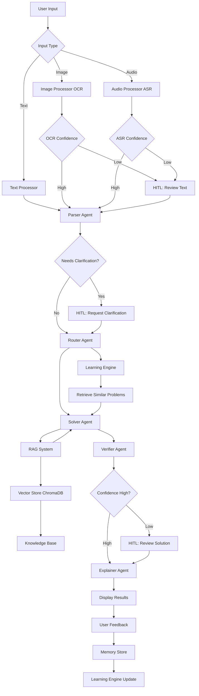
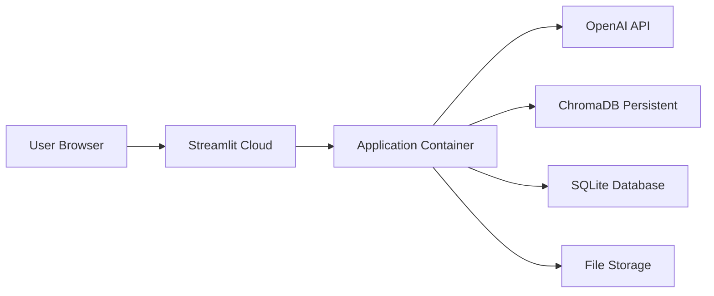

# Math Mentor - System Architecture

## Overview

Math Mentor is a multimodal AI application that solves JEE-style math problems using a multi-agent system, RAG pipeline, human-in-the-loop intervention, and memory-based learning.

## System Architecture Diagram

## Component Architecture

### 1. Input Processing Layer

**Purpose**: Handle multimodal inputs and convert to text

**Components**:
- **ImageProcessor**: Uses EasyOCR for text extraction from images
  - Supports printed and handwritten text
  - Calculates confidence scores
  - Triggers HITL for low confidence
  
- **AudioProcessor**: Uses OpenAI Whisper for speech-to-text
  - Handles math-specific vocabulary
  - Post-processes mathematical terms
  - Triggers HITL for unclear transcriptions
  
- **TextProcessor**: Validates and normalizes direct text input
  - Simple validation
  - Whitespace normalization

### 2. Multi-Agent System

**Purpose**: Orchestrate problem solving through specialized agents

**Agents**:

1. **Parser Agent** (GPT-3.5-turbo)
   - Cleans and structures input
   - Identifies topic and subtopic
   - Extracts variables and constraints
   - Detects ambiguities
   - Triggers HITL if clarification needed

2. **Router Agent** (GPT-3.5-turbo)
   - Classifies problem type
   - Determines difficulty level
   - Selects required tools
   - Recommends solution strategy
   - Routes to appropriate workflow

3. **Solver Agent** (GPT-4)
   - Queries RAG system for context
   - Plans solution approach
   - Executes step-by-step solution
   - Uses computational tools (SymPy)
   - Generates intermediate results

4. **Verifier Agent** (GPT-4)
   - Validates solution correctness
   - Checks mathematical rigor
   - Verifies units and domains
   - Tests edge cases
   - Calculates confidence score
   - Triggers HITL if confidence < 0.8

5. **Explainer Agent** (GPT-3.5-turbo)
   - Generates student-friendly explanations
   - Breaks down complex steps
   - Provides intuition
   - Cites formulas and sources
   - Highlights common mistakes

### 3. RAG Pipeline

**Purpose**: Retrieve relevant mathematical knowledge

**Components**:

- **EmbeddingGenerator**
  - Supports OpenAI embeddings (text-embedding-3-small)
  - Fallback to sentence-transformers
  - Batch processing for efficiency

- **VectorStore** (ChromaDB)
  - Persistent vector storage
  - Document chunking (500 chars, 50 overlap)
  - Metadata filtering by topic
  - Similarity search

- **Retriever**
  - Semantic search
  - Topic-based filtering
  - Re-ranking by relevance
  - Source citation tracking

- **Knowledge Base**
  - Algebra: equations, polynomials, inequalities
  - Calculus: limits, derivatives, optimization
  - Probability: basic probability, combinations, Bayes
  - Linear Algebra: matrices, vectors, transformations
  - Problem-solving strategies

### 4. Memory & Learning System

**Purpose**: Store interactions and improve over time

**Components**:

- **MemoryStore** (SQLite)
  - Stores solved problems
  - Tracks user feedback
  - Indexes by topic and timestamp
  - Supports similarity queries

- **LearningEngine**
  - Finds similar solved problems
  - Extracts solution patterns
  - Applies OCR/ASR corrections
  - Provides learning insights
  - Calculates success rates

### 5. Human-in-the-Loop (HITL)

**Purpose**: Enable human intervention when needed

**Triggers**:
- Low OCR confidence (< 0.7)
- Low ASR confidence
- Parser detects ambiguity
- Low verifier confidence (< 0.8)
- User explicit request

**Actions**:
- Approve and continue
- Edit and continue
- Reject and restart
- Add context

**Learning**:
- Corrections stored in memory
- Patterns applied to future inputs
- Improves system over time

### 6. User Interface (Streamlit)

**Purpose**: Provide intuitive interface for users

**Features**:
- Three input modes (Text, Image, Audio)
- Extraction preview with editing
- Real-time agent trace
- Retrieved context display
- Confidence indicators
- Step-by-step explanations
- Feedback collection
- Similar problems sidebar

## Data Flow

1. **Input Phase**:
   - User provides input (text/image/audio)
   - Input processor extracts/transcribes text
   - HITL triggered if confidence low
   - User confirms or edits text

2. **Parsing Phase**:
   - Parser Agent structures problem
   - Identifies topic, variables, constraints
   - HITL triggered if ambiguous
   - User provides clarification if needed

3. **Routing Phase**:
   - Router Agent classifies problem
   - Determines workflow and tools
   - Learning Engine retrieves similar problems

4. **Solving Phase**:
   - Solver Agent queries RAG system
   - Retrieves relevant formulas/patterns
   - Generates step-by-step solution
   - Uses computational tools as needed

5. **Verification Phase**:
   - Verifier Agent checks correctness
   - Validates logic and calculations
   - Calculates confidence score
   - HITL triggered if confidence low

6. **Explanation Phase**:
   - Explainer Agent generates explanation
   - Formats for student understanding
   - Cites sources and formulas

7. **Feedback Phase**:
   - Results displayed to user
   - User provides feedback (correct/incorrect)
   - Problem stored in memory
   - Learning Engine updated

## Technology Stack

  - Backend: Python 3.9+
  - LLM: Groq (llama-3.1-8b-instant) [default]
  - OCR: EasyOCR
  - ASR: Groq Whisper (whisper-large-v3-turbo) [primary] / OpenAI Whisper [fallback]
  - Vector Store: ChromaDB
  - Embeddings: sentence-transformers (all-MiniLM-L6-v2) [default]
  - Database: SQLite
  - UI: Streamlit
  - Math Tools: SymPy
  - Framework: Custom multi-agent system (no LangChain)

## Deployment Architecture

**Deployment Platform**: Streamlit Cloud

**Persistent Storage**:
- ChromaDB: Vector embeddings
- SQLite: Problem history and feedback
- File System: Uploaded images/audio

## Security & Privacy

- API keys stored in environment variables
- User uploads stored locally (not shared)
- No personal data collected
- Feedback anonymous
- HTTPS encryption (via Streamlit Cloud)

## Scalability Considerations

**Current Design** (MVP):
- Single-user sessions
- Local file storage
- Embedded vector store

**Future Enhancements**:
- Multi-user support with authentication
- Cloud storage (S3/GCS)
- Distributed vector store
- Caching layer for common problems
- Batch processing for efficiency
- Model fine-tuning on feedback data

## Performance Optimization

1. **Caching**:
   - Streamlit resource caching for components
   - Embedding caching to reduce API calls
   - Similar problem caching

2. **Batching**:
   - Batch embedding generation
   - Batch database operations

3. **Lazy Loading**:
   - Load agents on-demand
   - Initialize OCR/ASR only when needed

4. **Model Selection**:
   - GPT-3.5 for simpler agents (Parser, Router, Explainer)
   - GPT-4 for critical agents (Solver, Verifier)

## Error Handling

- Graceful degradation for API failures
- Retry logic with exponential backoff
- Fallback to simpler models
- User-friendly error messages
- Detailed logging for debugging

## Monitoring & Observability

- Agent execution traces
- Confidence score tracking
- User feedback metrics
- Success rate calculation
- Topic distribution analysis
- HITL trigger frequency

## Future Roadmap

1. **Enhanced Multimodal**:
   - Handwriting recognition improvements
   - Diagram/graph understanding
   - LaTeX output support

2. **Advanced Agents**:
   - Guardrail Agent for safety
   - Evaluator Agent for self-assessment
   - Web search integration with citations

3. **Learning Improvements**:
   - Active learning from feedback
   - Model fine-tuning
   - Personalized problem recommendations

4. **Collaboration**:
   - Teacher dashboard
   - Student progress tracking
   - Classroom integration

5. **Extended Topics**:
   - Geometry and trigonometry
   - Statistics and data analysis
   - Advanced calculus
   - Olympiad-level problems
